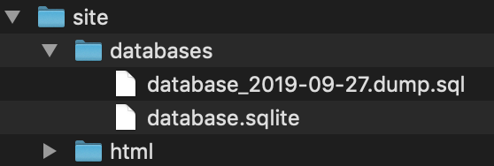
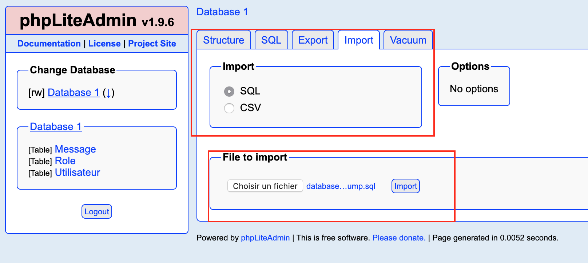

# STI-Project1

> Auteurs : Sutcu Volkan & Benoit Julien  
> Date : 10.10.2019

## Introduction

Le but de ce projet était de créer un site web permettant d’échanger des messages à travers une base de données entre les utilisateurs et de gérer ces derniers. Nous étions mandaté par une entreprise qui n’avait malheureusement pas le budget pour s’occuper de l’aspect sécuritaire de l’application.

## Comment lancer l'application

Afin de lancer notre application, il faut au préalable avoir Docker installé sur la machine.

L’arborescence de fichiers doit être comme sur l’image si dessous :



Tout ce qui concerne le site doit se trouver dans le dossier `html` et tout ce qui concerne la base de données dans le dossier `databases`. 

Pour lancer le container Docker avec le serveur nginx et PHP5, il faut ouvrir un terminal et se positionner dans le répertoire contenant le dossier `site` via la commande `cd ` puis faire comme suit :

1. lancer la commande :

   ```bash
   docker run -ti -v "$PWD/site":/usr/share/nginx/ -d -p 8080:80 --name sti_project --hostname sti arubinst/sti:project2018
   ```

   Le port 8080 peut être changé par un autre port si cela vous convient mieux.

2. Ensuite, pour lancer les services nginx et PHP, lancer les commandes suivantes :

   ```bash
   docker exec -u root sti_project service nginx start
   docker exec -u root sti_project service php5-fpm start
   ```

3. Puis, accéder à la page d’administration de la base de données qui se trouve à l’adresse 

   - **Pour Docker toolbox avec port 8080 :**	http://192.168.99.100:8080/phpliteadmin.php
   - **Pour Docker Desktop avec port 8080 :**   http://localhost:8080/phpliteadmin.php

   **Note:** pour accéder à la console d'administration, taper "admin" pour le mot de passe

   Ensuite, il faut aller dans l'onglet "Import", sélectionner "SQL" et importer le fichier sql `database_2019-09-27.dump.sql` qui se trouve dans le dossier `site/databases/` via le bouton "Choisir un fichier" puis "Import" comme ci-dessous:

   

   

Les 2 utilisateurs suivants seront créés avec chacun, leur mot de passe et un rôle : 

- volkan / volkan2019 (administrateur)
- julien / julien2019 (collaborateur)

Afin d'accéder à l'application, aller dans un navigateur web et taper l'adresse suivante:

- **Pour Docker toolbox avec port 8080 :**	http://192.168.99.100:8080/ 
- **Pour Docker Desktop avec port 8080 :**	http://localhost:8080/

À ce stade, vous pouvez aisément utiliser l'application. Une fois terminé, il suffit de quitter le navigateur web et de stopper le conteneur Docker avec la commande suivante: 

```bash
docker stop sti_project
```

